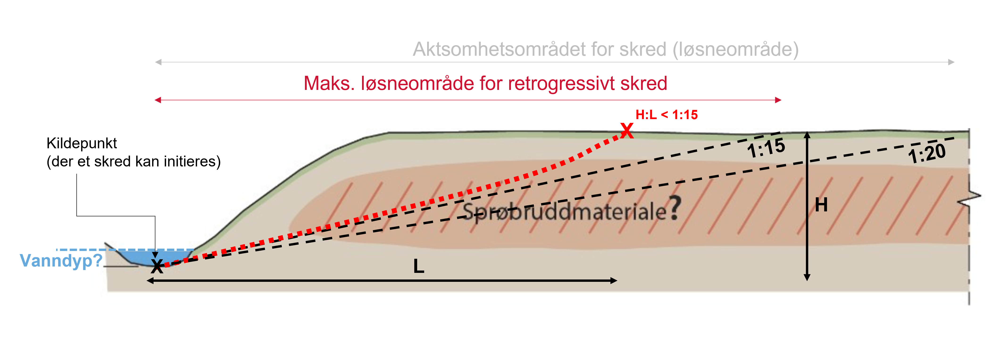

# Losneomrade

Python package for calculating the maximum release area of retrogressive
landslides in quick-clay slopes, based on **NVE Kvikkleireveileder 1/2019**.

The package provides three analysis approaches:

- `terrain_criteria` — fast pixel-based slope screening over a DEM
- `retrogression` — step-wise propagation from an initial release area
- `profile_retrogression` — cross-section based retrogression analysis



## Installation

```bash
pip install git+https://github.com/cgodoyle/losneomrade.git
```

## Quick example

```python
import geopandas as gpd
from shapely.geometry import LineString

from losneomrade import masks, retrogression

bounds = (268463.9, 6651396.2, 270007.6, 6652564.4)  # xmin, ymin, xmax, ymax

source_line = gpd.GeoDataFrame(
    geometry=[LineString([
        (268883.5, 6651785.9),
        (268917.3, 6651614.7),
        (269098.9, 6651692.1),
        (269266.9, 6651685.2),
        (269430.1, 6651718.2),
        (269573.4, 6651894.1),
    ])],
    crs=25833,
)

mask = masks.get_msml_mask(bounds)

result = retrogression.run_retrogression(
    bounds=bounds,
    rel_shape=source_line,
    point_depth=0.5,
    mask=mask,
    min_slope=1 / 15,
    min_height=5,
    min_length=75,
)
```

## Documentation

For installation, theory, API overview, breaking changes, and contributor
guidance, see:

**https://cgodoyle.github.io/losneomrade/**

## Reference

**NVE (2020), Veileder nr. 1/2019**. *Sikkerhet mot kvikkleireskred: vurdering
av omradestabilitet ved arealplanlegging og utbygging i omrader med kvikkleire
og andre jordarter med sprobruddegenskaper.*
