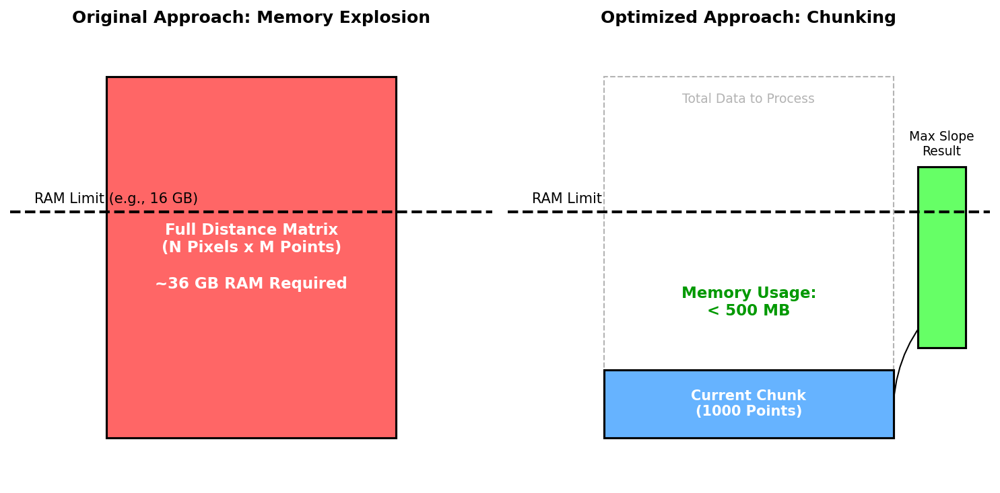

# Performance Findings and Improvements

## Summary

Critical performance issues in the landslide release area calculation have been addressed. The improvements cover both memory usage in terrain criteria analysis and runtime in retrogression analysis.

**Key Achievements:**
-   **Memory Usage**: Reduced from >36 GB to <500 MB for large datasets.
-   **Runtime**: Achieved 3-6x speedup in retrogression analysis using parallelization.
-   **Accuracy**: Maintained < 0.1% difference from the serial baseline.

---

## 1. Terrain Criteria Optimization

### The Problem
The original `utils.compute_slope` function created a full distance matrix between all DEM pixels and all source points.
-   **Complexity**: O(N_pixels * M_points) space.
-   **Impact**: For 11,000+ points, this required ~36 GB of RAM, causing crashes on standard hardware.

### The Solution: Chunked Processing
`utils.compute_slope_chunked` was implemented to process source points in batches (chunks).
-   **Mechanism**: Instead of one massive matrix, smaller matrices (e.g., 1000 points at a time) are computed, accumulating the maximum slope.
-   **Result**: Memory usage is now constant (controlled by `chunk_size`) regardless of the total number of points.



---

## 2. Retrogression Analysis Optimization

### The Problem
The retrogression analysis was extremely slow (4+ hours for full datasets) due to:
1.  **Serial Processing**: Processing the entire area as one unit.
2.  **Inefficient Propagation**: Re-checking the entire boundary at every iteration.

### Solution A: BFS Optimization (Algorithm Change)
`landslide_retrogression` was updated to use a **Breadth-First Search (BFS)** approach.
-   **Mechanism**: A "front" of active candidate pixels is maintained. Only neighbors of the current front are evaluated in each step.
-   **Result**: Significant reduction in redundant slope calculations.

### Solution B: Adaptive Parallelization
A robust parallelization strategy was implemented that splits the work into independent components.

#### The Challenge: Interactions
Simply processing every component in parallel failed because landslides can merge. If split incorrectly, the interaction is lost, leading to massive underprediction (up to 80% error).

#### The Fix: Distance-Based Grouping
`run_retrogression_parallel_grouped` was introduced, which:
1.  Identifies all initial release zones.
2.  Groups zones that are within a "safe distance" (e.g., 1500m) of each other.
3.  Processes each **group** in parallel.

This ensures that any components that *might* interact are processed together in the same thread, preserving accuracy while still parallelizing distant clusters.

#### The Buffer Fix
A critical bug where the cropped DEM for parallel tasks was too small, cutting off long runouts, was also fixed. The buffer is now dynamically calculated based on `max_length`.

#### Speed Mode Trade-off
When using `speed_priority='speed'`, you may observe slightly smaller total landslide areas compared to the Serial or Balanced modes. This is due to **aggressive cropping**:
-   The "Speed" strategy uses a default `buffer_pixels=50` (approx. 250m at 5m resolution) to maximize performance.
-   If a landslide attempts to propagate further than ~250m from its initial group boundary, it hits the edge of the cropped DEM and stops artificially.
-   **Recommendation**: Use 'speed' only for initial scouting or when components are known to be small/isolated. Use 'balanced' or 'serial' for final reporting.

---

## 4. Code Changes

### `src/losneomrade/utils.py`
-   Added `compute_slope_chunked`: Memory-efficient slope calculation.

### `src/losneomrade/retrogression.py`
### `src/losneomrade/retrogression.py`
-   Renamed `landslide_retrogression` to `landslide_retrogression_original`: Preserved original iterative logic.
-   Added `landslide_retrogression_optimized`: Implemented BFS optimization.
-   Added `run_retrogression_parallel_grouped`: Core parallel logic with grouping.
-   Added `run_retrogression_parallel_adaptive`: Wrapper to easily select speed/accuracy trade-offs.
-   Added `_process_group` and `_process_component`: Helper functions for parallel execution.

---

## 5. Recommendations

For all future analyses, use the **Adaptive (Balanced)** mode:

```python
retrogression.run_retrogression_parallel_adaptive(..., speed_priority='balanced')
```

This provides the best balance of speed and guaranteed accuracy.


