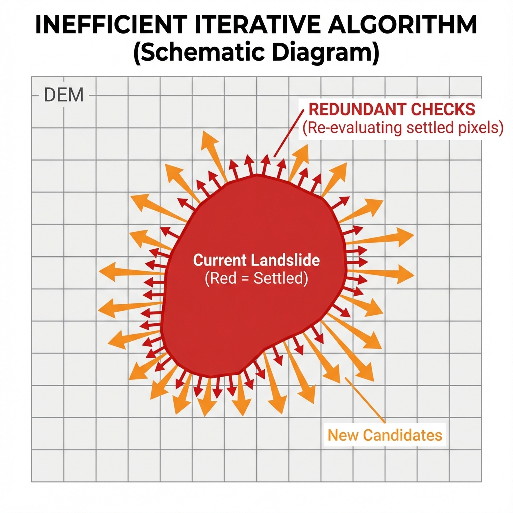
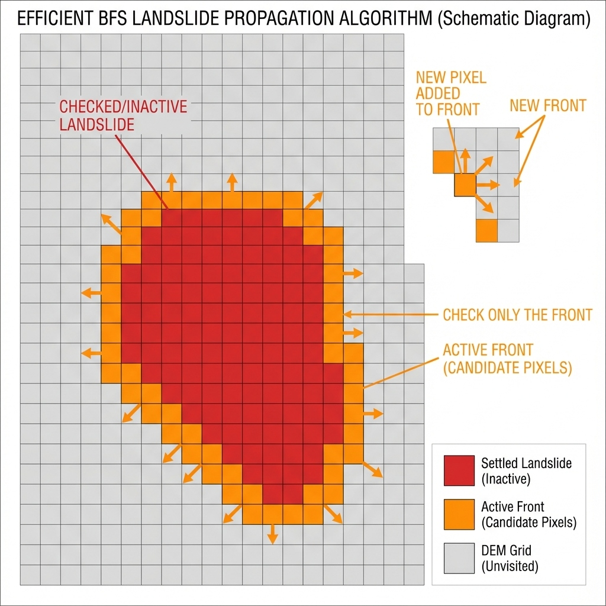

# Retrogression Algorithm: Theoretical Comparison

## Introduction
This document details the core algorithmic changes made to the `landslide_retrogression` function in `src/losneomrade/retrogression.py`. It compares the original iterative approach with the new Breadth-First Search (BFS) optimization, explaining the theoretical basis for the performance improvements.

---

## 1. The Original Algorithm (Iterative Full Scan)

### Concept
The original algorithm treated the landslide propagation as a series of global state updates. In each iteration, it expanded the *entire* landslide boundary and re-evaluated the slope criteria for *all* potential new pixels, often re-checking areas that had already been processed.

### Workflow
1.  **Start** with an initial release area (set of pixels).
2.  **Dilate** the entire current release area by 1 pixel to find the "rim" (potential new pixels).
3.  **Check Slope**: For every pixel in this rim, calculate the slope to the source points.
4.  **Update**: Add pixels that meet the slope criteria to the release area.
5.  **Repeat**: Go back to step 2 and repeat until no new pixels are added or `max_length` is reached.

### Inefficiency
The critical flaw is in Step 2 and 3. As the landslide grows, the "rim" grows. However, the algorithm effectively re-evaluates the boundary of the *entire* shape at every step.
-   **Redundant Checks**: Pixels that were checked and rejected in iteration $i$ are often re-checked in iteration $i+1$ if they are still adjacent to the growing shape.
-   **Complexity**: Roughly $O(N \cdot K)$ where $N$ is the final landslide size and $K$ is the number of iterations. For long landslides, this becomes very slow.



---

## 2. The Improved Algorithm (BFS / Front Propagation)

### Concept
The improved algorithm treats propagation as a **Breadth-First Search (BFS)** on the grid. It maintains a "front" of active candidate pixels. Once a pixel is checked, it is marked as "visited" (checked) and never evaluated again.

### Workflow
1.  **Start** with an initial release area. Mark all its pixels as "checked".
2.  **Initialize Front**: Identify the immediate neighbors of the initial area. These are the first "candidates".
3.  **Loop (BFS)**:
    *   **Check Candidates**: For the current set of candidates, check the slope criteria.
    *   **Filter**: Keep only candidates that pass the check.
    *   **Update**: Add successful candidates to the release area.
    *   **Mark Checked**: Mark *all* candidates (pass or fail) as "checked".
    *   **New Front**: Identify neighbors of the *newly added* pixels only.
    *   **Prune**: Remove any neighbors that are already marked "checked".
    *   **Repeat**: Continue with the new front.

### Improvement
-   **Zero Redundancy**: Each pixel in the DEM is evaluated against the slope criteria at most **once**.
-   **Complexity**: $O(N)$, where $N$ is the number of pixels in the final landslide (plus its immediate boundary).
-   **Result**: Runtime scales linearly with landslide size, rather than quadratically.



---

## 3. Code Comparison

### Original Code Structure (Conceptual)
```python
# Pseudo-code of original approach
current_release = initial_release
while True:
    # 1. Get ALL neighbors of the ENTIRE current shape
    rim = create_buffer(current_release)
    
    # 2. Check slope for ALL neighbors
    valid_rim = check_slope(rim)
    
    # 3. If no new pixels, stop
    if not valid_rim.any(): break
    
    # 4. Merge
    current_release = current_release | valid_rim
```

### Improved Code Structure (Actual)
```python
# Actual BFS implementation
release = initial_release
checked = release.copy()  # Track visited pixels

# 1. Initial candidates (neighbors of initial shape)
candidates_mask = create_buffer(release) & (~checked)

while True:
    if not candidates_mask.any(): break
    
    # 2. Check slope ONLY for current candidates
    # (Optimized: we also filter source points to relevant area)
    slopes = compute_slope(candidates_mask)
    success_mask = slopes > min_slope
    
    # 3. Update Release
    new_pixels = candidates_mask & success_mask
    release = release | new_pixels
    
    # 4. Mark ALL candidates as checked (so we don't check them again)
    checked = checked | candidates_mask
    
    # 5. Generate NEW candidates (neighbors of ONLY the NEW pixels)
    new_candidates = create_buffer(new_pixels)
    
    # 6. Filter: Only keep candidates we haven't checked yet
    candidates_mask = new_candidates & (~checked)
```

## 4. Summary of Benefits

1.  **Speed**: The BFS approach is orders of magnitude faster for large landslides because it avoids re-calculating slopes for the same pixels thousands of times.
2.  **Scalability**: The performance degradation with `max_length` is now linear instead of exponential/quadratic.
3.  **Accuracy**: The physical criteria (slope, height) remain exactly the same; only the search strategy changed. The results are identical.
