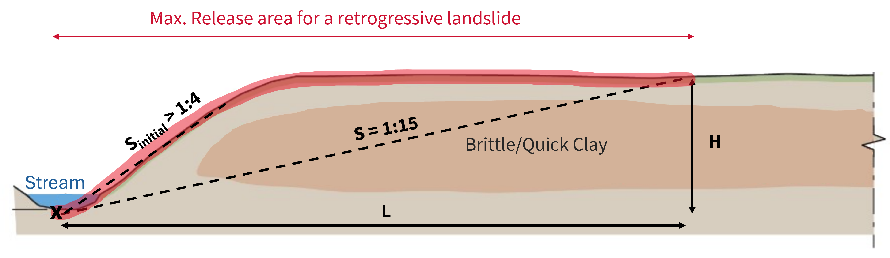

# Theory

## The 1:15 slope criterion

The Norwegian Water Resources and Energy Directorate (NVE) established in
**Kvikkleireveileder 1/2019** that a conservative limit for landslide
retrogression in quick-clay is a slope of **1:15** (vertical:horizontal).

This means: for every 1 meter of height difference, the landslide can
propagate up to 15 meters horizontally.

The same conceptual model is also used for the two-phase retrogression workflow:
an initial slope around **1:4** can be used to evaluate whether **erosion may
trigger an initial landslide**, followed by retrogressive propagation using the
more conservative **1:15** criterion.

## Methods

### Terrain Criteria

**What it does**: For each pixel in the DEM, checks if the slope from that
pixel back to any source point exceeds 1:15 (or a custom threshold).

**How it works**:

1. Load a DEM (from Høydedata or a local raster)
2. For each pixel, compute the slope to the nearest source point
3. Classify pixels by slope: 1:20, 1:15, 1:10, 1:5, 1:3
4. Polygonize the result into a GeoDataFrame

**Best for**: Quick overview of potentially affected areas. Fast, memory-efficient.

**Limitations**: Doesn't model actual propagation — just geometric reach.

---

### Retrogression

**What it does**: Starting from an initial release area, expands outward
step-by-step, only into pixels where the slope criterion is met.

**How it works**:

1. Rasterize the source geometry onto the DEM
2. Create a buffer ring around the current release
3. For each pixel in the buffer, check if the slope from the source
   to that pixel exceeds the threshold
4. Add qualifying pixels to the release area
5. Repeat until no more pixels qualify (or max_length reached)

**Best for**: Continuous, realistic release area shapes. Honors terrain
features that might block propagation.

**Variants**:

- `run_retrogression()` — Single-phase with one slope threshold
- `run_retrogression_with_initial_landslide()` — Two phases:
  first a steep initial failure criterion (e.g. 1:4) to assess whether
  erosion can trigger an initial slide, then retrogressive propagation
  with 1:15

---

### Profile Retrogression

**What it does**: Analyzes retrogression along cross-section profiles
perpendicular to a source line.

**How it works**:

1. Generate terrain profiles perpendicular to the source line
2. For each profile, find where the 1:15 slope criterion is met
3. Connect the retrogression points across profiles
4. Build a release area polygon from the connected points

**Best for**: Detailed analysis along a known escarpment or riverbank.
Gives you control over the analysis direction.

**Limitations**: Requires pre-defined profile lines.

## Parameters

All methods share key parameters:

| Parameter | Default | Meaning |
|-----------|---------|---------|
| `min_slope` | 1/15 | Slope threshold (steeper = less propagation) |
| `min_height` | 5 m | Minimum height difference to start checking slope |
| `min_length` | 75 m | Unconditional propagation distance before slope check |
| `mask` | None | GeoDataFrame to clip results (typically MSML) |
