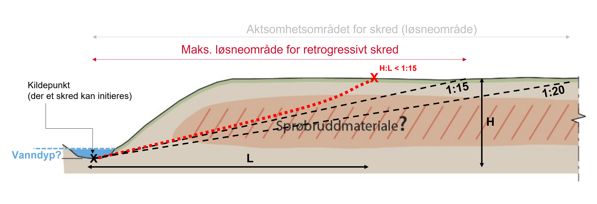

# Quick Clay Release Area (Kvikkkleire løsneområde) -- Losneomrade package

**A python package for calculating the maximum retrogression of landslides in quick-clay slopes**

## Introduction



This package is intended to be used for calculating the maximum retrogression of landslides in quick-clay. The package is based on the method described in [NVE Kvikkleireveileder 1/2019](https://publikasjoner.nve.no/veileder/2019/veileder2019_01.pdf), ie, assumes that the landslide retrogression is controlled by the slope of the terrain, and a slope of 1:15 is conservative enough to be used as a limit.

Two modules are develop to calculate the maximum retrogression of landslides in quick-clay:
* terrain_criteria: pixel-based verification of the terrain criteria (slope > 1:15) over the digital elevation model.
* retrogression: step-wise calculation of the terrain criteria starting from the initial/source area.

The digital elevation model (DEM) can be automatically fetched from Høydedata.no, or can be given as an input. Addinional option for clipping the results against the MSML (mulighet for sammenhengende marin leire: NGUs "mulig marin leire" without low probability/uncontinuous/thin layers) is also available. Both the slope criterium (default 1:15) and minimum height (default 5m) can be modified according to the user's needs.

Both method should give similar results, but the terrain_criteria method is faster and less memory demanding. The retrogression method is computes a  consistent/continuous release area, but is slower. 

Additionally, the package contains a module with some utility functions for rasterizing, polygonizing the results, query Høydedata.no and NVEs MSML.


## Installation
Install the package using pip:
```bash
pip install git+https://github.com/cgodoyle/losneomrade.git
```

## Usage

```python
import numpy as np
import geopandas as gpd
from losneomrade import terrain_criteria, retrogression

# define computation bounds
xmin, xmax, ymin, ymax = 268463.9, 270007.6, 6651396.2, 6652564.4
# define sourcepoints
points  = np.array([[ 268883.54006222, 6651785.96167226],
                    [ 268907.86379685, 6651662.57470644],
                    [ 268984.48727134, 6651618.69204597],
                    [ 269090.36143902, 6651686.56433795],
                    [ 269207.33980788, 6651668.23740238],
                    [ 269330.55864216, 6651689.9979547 ],
                    [ 269423.18151256, 6651736.06328901],
                    [ 269497.68960659, 6651807.85350652],
                    [ 265169.57254198, 6648213.09660508]])

tc = terrain_criteria.run_terrain_criteria(bounds=(xmin, xmax, ymin, ymax),
                                           source=points,
                                           source_depth=0.5,
                                           clip_to_msml=True,
                                           h_min=5
                                          )


# retrogression
sourcepoints = gpd.GeoDataFrame(
    geometry=gpd.points_from_xy(points[:,0], points[:,1]),
    crs=25833,
    )
akt=    retrogression.run_retrogression(
            bounds = (xmin,xmax,ymin,ymax),
            rel_shape=sourcepoints,
            point_depth=0.5,
            clip_to_msml=True,
            min_slope=1/15,
            min_length=75,
            min_height=5,
            return_animation=False,
        )

```

## Feedback
If you find a bug, or have any feedback, ideas or comments, please email me at crgo@nve.no.


## References
**NVE (2020), Veileder nr. 1/2019**. Sikkerhet mot kvikkleireskred : vurdering av områdestabilitet ved
arealplanlegging og utbygging i områder med kvikkleire og andre jordarter med sprøbruddegenskaper.
https://publikasjoner.nve.no/veileder/2019/veileder2019_01.pdf
